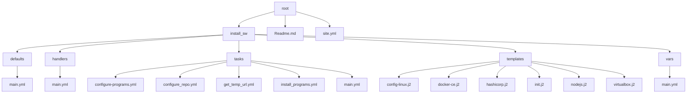

[](https://pypi.org/project/ansible-core)
[](https://docs.ansible.com/ansible/latest/)
[](https://docs.ansible.com/ansible/latest/community/communication.html)
[](https://dev.azure.com/ansible/ansible/_build/latest?definitionId=20&branchName=devel)
[](https://docs.ansible.com/ansible/latest/community/code_of_conduct.html)
[](https://docs.ansible.com/ansible/latest/community/communication.html#mailing-list-information)
[](COPYING)
[](https://bestpractices.coreinfrastructure.org/projects/2372)

## Licencia
Distribuido bajo la licencia XYZ. Ver `LICENSE` para más información.

# Configurar tu pc/latop para programar en entornos de desarrollo o devops

## Motivo
Cada vez que me instalo una maquina debo configurar mi entorno de escritorio, esto no es seguido, pero entiendase que configurar todo tu equipo tomo al menos unas cuantas horas ó cuando tienes varias personas en una empresa y quieres instalarle o instalarte todos los programas incluyendo los famosos utilitarios como es mi caso entonces opto por programs_devops que me facilita todo desde la primera instalación.

## Estructura de directorios


## Paquetes 
<pre>
-          <a href="www.github.com">git</a>
-         <a href="ansible.com">ansible</a>
</pre>

# Alcance

- **[Ubuntu 22.04](www.ubuntu.com)** 

## Procedimiento de instalacion
Para poder tener a disponibilidad todos los paquetes se debe instalar el SO ubuntu en tu maquina (ver video) 

a. [Instalar Ubuntu destkop](https://www.youtube.com/watch?v=8MRibUo9VAA)

b. Instalar ansible 

```shell
apt install python3 
apt install python3-pip
pip3 install ansible-core
ansible-galaxy collection install community.general
```

```shell
ansible-playbook -i inventory site.yml -u <tu usuario> --private-keys <tu_llave>
```

c.- Habilitar el usuario
```yaml
    # Modificar el usuario dentro de la estructura de directorios
    usuarios:
     - user: eflores
       home: /home/eflores
       tmp: /tmp
       path: /tmp/examples
    # El usuario lo reemplazas por el nombre declarado en tu cuenta
```

# Autor
@sfi-networks


