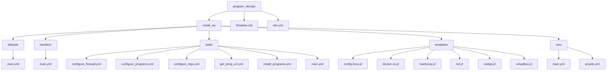

[](https://docs.ansible.com/ansible/latest/)
[](https://docs.ansible.com/ansible/latest/community/communication.html)
[](https://docs.ansible.com/ansible/latest/community/code_of_conduct.html)
[](https://docs.ansible.com/ansible/latest/community/communication.html#mailing-list-information)
[](https://www.gnu.org/licenses/gpl-3.0.html)
[](https://bestpractices.coreinfrastructure.org/projects/2372)

# Configure the laptop and pc for program the environment developer

### Motivo
When input the working, this company 
Cada vez que me facilitan una maquina debo configurar mi entorno de escritorio para desarrollar tecnologías en devops, esto no es seguido, pero entiendase que configurar todo tu equipo toma al menos unas cuantas horas por ende decidí crear un playbook que me permita configurar mi equipo con todo lo que necesito.

### Estructura de directorios


a. *program_devops*: Directorio en donde se define el projecto.

b. *install_sw*: Directorio que contiene los roles

1. defaults: Directorio donde se declara los nombres de paquetes a instalar por ejemplo: samba, samba-utils, code, etc...

2. handlers: Directorio que contiene el archivo main.yml para reiniciar el servicio, en este caso el ssh u otro demonio

3. tasks: Directorio que contiene los playbooks a desplegar

4. templates: Plantillas donde se configura los archivos jinja2 donde se personaliza el entorno a configurar

5. vars: Define the values from project with urls of packages and user's configuration
    * The private_yml file is encrypted because it contains sensitive information, such as passwords. This makes it useful for securely declaring and storing confidential values.

        a. _git_user_name_: << you user account in [github](https://github.com)>>

        b. _git_user_email_: << you email account register in github or personal email >>

        c. _token_pro_ubuntu_: << The token from ubuntu pro, this is free, you register in canonical >>
        
    **Note:** If you prefer, you can leave the values blank, but you must declare the variables as empty.
6. defaults: Contiene la configuración por defecto para el ansible.

# Alcance

- **[Ubuntu 22.04](https://www.ubuntu.com)** 
- **[Xubuntu 22.04](https://xubuntu.org/)**

## Procedimiento de instalacion
Para poder tener a disponibilidad todos los paquetes se debe instalar el SO ubuntu en tu maquina (ver video) 

a. [Instalar Ubuntu destkop](https://www.youtube.com/watch?v=8MRibUo9VAA)

b. Instalar ansible 

```shell
sudo apt install python3 python3-pip
sudo pip3 install ansible-core
ansible-galaxy collection install community.general
ansible-galaxy collection install ansible.posix
```

```shell
ansible-playbook -i inventory site.yml -u <tu usuario> --private-keys <tu_llave>
```

## Contacts
* **Autor:** [Edwin Enrique Flores Bautista](https://www.linkedin.com/in/edwin-enrique-flores-bautista/)
* **Email:** 2000923@unmsm.edu.pe
