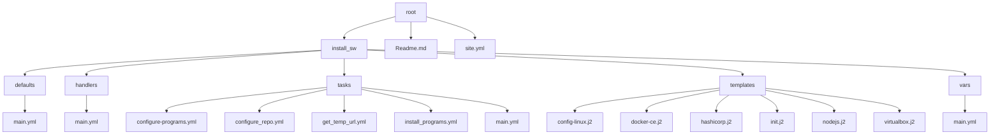

# Configurar tu pc/latop para programar para devops

## Motivo
En sfinetworks deseamos facilitar las herramientas necesarias para que cada integrante que se incorpora pueda instalar todos los programas necesarios que se usa en la empresa, fiel a su estilo sfi-networks apuesta por el codigo abierto (opensource) que de la mano con ansible te permite tener tu maquina lista para programar.

## Objetivo
Facilitar al compañero las herramientas de manera rapida y que se pueda acoplar al equipo en el menor tiempo posible

## Estructura de directorios


## Paquetes 
<pre>
-          <a href="www.github.com">git</a>
-         <a href="ansible.com">ansible</a>
</pre>

# Alcance

- **[Ubuntu 22.04](www.ubuntu.com)** 

## Procedimiento de instalacion
Para poder tener a disponibilidad todos los paquetes se debe instalar el SO ubuntu en tu maquina (ver video) 

a. [Instalar Ubuntu destkop](https://www.youtube.com/watch?v=8MRibUo9VAA)

b. Instalar ansible 

```shell
apt install python3 
apt install python3-pip
pip3 install ansible-core
```

```shell
ansible-playbook -i inventory site.yml -u <tu usuario> --private-keys <tu_llave>
```

c.- Habilitar el usuario
```yaml
    # Modificar el usuario dentro de la estructura de directorios
    usuarios:
     - user: eflores
       home: /home/eflores
       tmp: /tmp
       path: /tmp/examples
    # El usuario lo reemplazas por el nombre declarado en tu cuenta
```

# Autor
@sfi-networks


